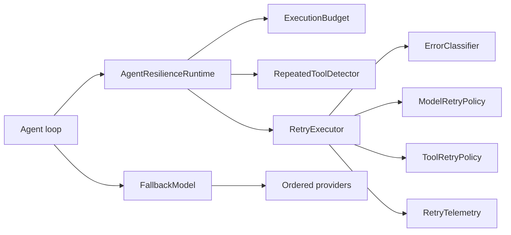
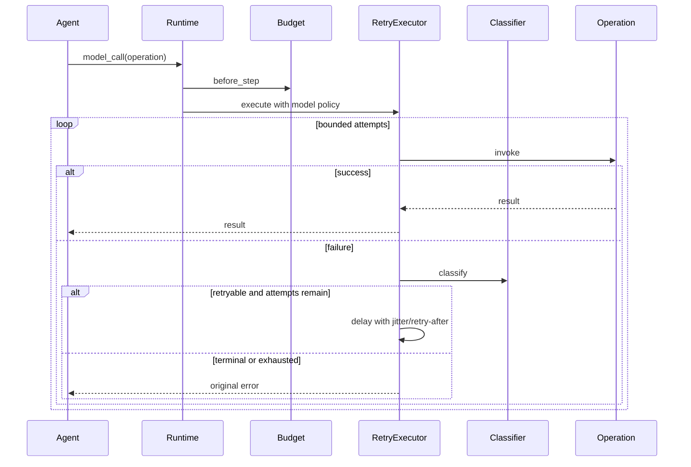

# Agent Resilience Runtime

Agent-aware failure classification, retries, fallbacks, loop detection, and step, deadline, token, and cost budgets for multi-step agents.

## Problem Statement

Agent execution chains model calls, tools, state changes, retries, and fallbacks. Generic HTTP retries cannot decide whether a tool is safe to repeat, whether authorization or validation can ever succeed on retry, or whether the overall execution has exhausted its time, token, cost, or step budget.

## What This Project Solves

Agent Resilience Runtime separates error classification, operation-specific retry policy, global execution guards, and provider fallback. Authorization, validation, budget, loop, and unknown permanent failures are terminal. Transient, timeout, and rate-limit failures can be retried deliberately within model or tool policies.

The runtime includes:

- conservative failure taxonomy and HTTP-status adaptation
- separate model and tool retry policies
- exponential backoff, bounded delay, deterministic jitter, and retry-after support
- retry attempt, retry, and exhaustion telemetry hooks
- maximum step and absolute deadline guards
- nullable provider-supplied token and cost accounting
- repeated tool name/argument detection
- ordered model fallback for retryable failure classes
- deterministic clocks, sleepers, random sources, and fake providers for tests

## When To Use It

Use this package inside an explicit agent loop when model and tool operations need different failure behavior and the full execution needs hard resource bounds. It composes with an existing workflow or agent framework; it does not replace one.

Do not retry authorization failures, invalid arguments, permanent business failures, or unknown exceptions without an application-specific classifier that makes the safety decision explicit.

## Architecture / HLD



Logical model or tool calls consume one step before any attempt. Retries do not hide additional logical steps, while the retry policy still bounds physical attempts. Tool fingerprints are checked before the side-effecting operation is invoked.

## Detailed Design / LLD



Errors are re-raised unchanged after policy decisions, preserving the original stack and application semantics. `FallbackExhaustedError` wraps the final retryable provider error when every provider fails.

## Public API / API Structure

| API | Responsibility |
| --- | --- |
| `ErrorClassifier`, `FailureKind`, `ClassifiedFailure` | Deterministic failure taxonomy |
| `RetryPolicy`, `ModelRetryPolicy`, `ToolRetryPolicy` | Attempt and delay configuration |
| `RetryExecutor`, `RetryTelemetry` | Bounded execution and telemetry |
| `BudgetLimits`, `ExecutionBudget`, `BudgetSnapshot` | Atomic execution resource guards |
| `RepeatedToolDetector` | Sliding-window tool-loop detection |
| `ModelProvider`, `FallbackModel` | Ordered provider fallback |
| `AgentResilienceRuntime` | Small composition layer for model/tool calls and usage |

## Core Concepts

### Classification before policy

`ErrorClassifier` recognizes typed package errors, Python timeout/connection errors, and exceptions exposing `status_code`. HTTP 401/403 are authorization failures, 429 is rate-limited, 5xx is transient, and other 4xx is validation. Unknown exceptions are permanent.

### Retry attempts

`max_attempts` includes the initial call. Delay before retry number `n` is:

```text
min(maximum_delay, initial_delay × multiplier^(n-1)) × jitter_factor
```

The jitter factor is bounded by `jitter_ratio`. A server-supplied retry-after value takes precedence when it is longer than policy delay.

### Budgets

`ExecutionBudget` is thread-safe. Step claims and usage updates are atomic. A rejected token or cost update leaves prior totals unchanged. Missing provider usage metadata contributes nothing; the runtime does not invent token or cost values.

### Tool loops

The loop detector hashes a canonical JSON encoding of tool name and arguments within a bounded window. Reordered object keys produce the same fingerprint. Reaching the repeat threshold raises before the next tool operation runs.

## Local Prerequisites

- Python 3.11 or newer
- Git
- No model credential or hosted service

## Steps To Run

```bash
git clone https://github.com/aniket-deshkar/agent-resilience-runtime.git
cd agent-resilience-runtime
python -m venv .venv
python -m pip install -e ".[dev]"
ruff check .
ruff format --check .
pytest
python -m build
```

## Configuration

Configuration is explicit Python data rather than global state:

```python
from datetime import UTC, datetime, timedelta
from decimal import Decimal

limits = BudgetLimits(
    max_steps=20,
    deadline=datetime.now(UTC) + timedelta(seconds=30),
    max_tokens=40_000,
    max_cost=Decimal("2.00"),
)
runtime = AgentResilienceRuntime(
    ExecutionBudget(limits),
    model_policy=ModelRetryPolicy(max_attempts=3),
    tool_policy=ToolRetryPolicy(max_attempts=2),
)
```

## Usage Examples

Run guarded operations:

```python
model_response = runtime.model_call(lambda: model.invoke(messages))
runtime.record_usage(
    input_tokens=model_response.input_tokens,
    output_tokens=model_response.output_tokens,
    cost=model_response.cost,
)

tool_result = runtime.tool_call(
    "account_lookup",
    {"account_id": "A-42"},
    lambda: account_tool("A-42"),
)
```

Use ordered fallback:

```python
fallback = FallbackModel(
    [
        ModelProvider("primary", primary.invoke),
        ModelProvider("secondary", secondary.invoke),
    ]
)
response = fallback.invoke({"messages": messages})
```

Fallback occurs only for configured failure kinds. Authorization, validation, budget, loop, and permanent errors stop immediately.

Inject deterministic time and backoff behavior in tests:

```python
executor = RetryExecutor(
    sleep=recorded_delays.append,
    random_value=lambda: 0.5,
    telemetry=telemetry,
)
budget = ExecutionBudget(limits, clock=fake_clock)
```

## Testing

The suite covers every failure class, HTTP status mapping, retry success/exhaustion, non-retryable failures, retry-after, exponential and jitter boundaries, invalid policies, step/deadline/token/cost budgets, atomic rejected usage, concurrent step claims, loop detection/reset, fallback success/exhaustion, and distinct model/tool policies.

CI runs 29 deterministic tests, Ruff, and source/wheel builds on Python 3.11 and 3.14 without external providers.

## Observability

Implement `RetryTelemetry` to receive attempt, retry, delay, classified failure, and exhaustion events. Implement `FallbackTelemetry` to receive provider selection and fallback transitions. Hooks receive metadata only and should avoid prompt or tool payload capture.

## Security

- Authorization and validation errors are never retried by default.
- Unknown exceptions are permanent by default.
- Fallback uses the same conservative classification.
- Loop checks happen before tool side effects.
- Cost values use `Decimal`; supply values only from trusted provider metadata.
- Keep prompts, arguments, credentials, and personal data out of telemetry hooks.
- See [SECURITY.md](SECURITY.md) for private reporting.

## Repository Structure

```text
src/agent_resilience_runtime/
├── failure.py   error taxonomy and classifier
├── retry.py     policies, backoff, execution, and telemetry
├── budget.py    atomic step/deadline/token/cost guards
├── loop.py      repeated-tool detection
├── fallback.py  ordered provider fallback
└── runtime.py   composition layer
tests/           deterministic fake-provider tests
```

## Design Decisions / Trade-offs

- Policy is separate from classification so applications can extend either without weakening defaults implicitly.
- Logical calls consume one step; retry attempts are bounded separately. This keeps step semantics stable across policy tuning.
- Fallback does not hide retries. Compose a provider's callable with `RetryExecutor` when both behaviors are required.
- Loop fingerprints serialize unknown values with `str`; adapters should pass stable JSON-compatible argument structures for repeatable behavior.
- The package has no network/provider dependency, keeping normal CI deterministic and credential-free.

## Contributing

See [CONTRIBUTING.md](CONTRIBUTING.md). Changes to classification or retry behavior require positive, terminal, exhaustion, and deterministic timing tests.

## License

Licensed under the Apache License 2.0. See [LICENSE](LICENSE).
